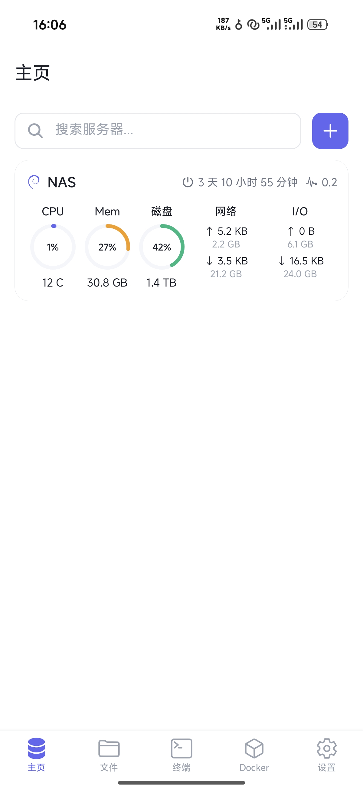
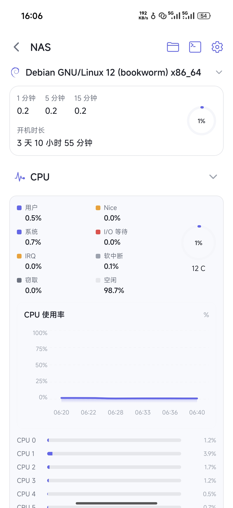
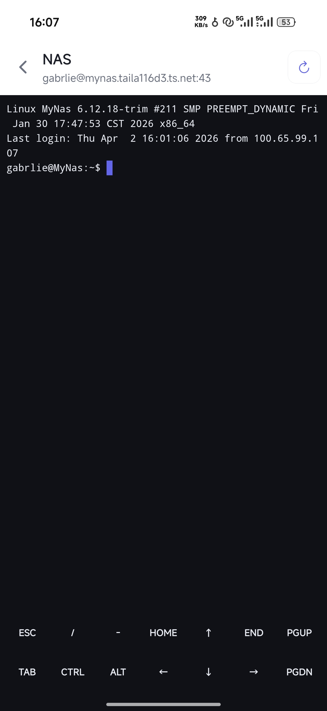
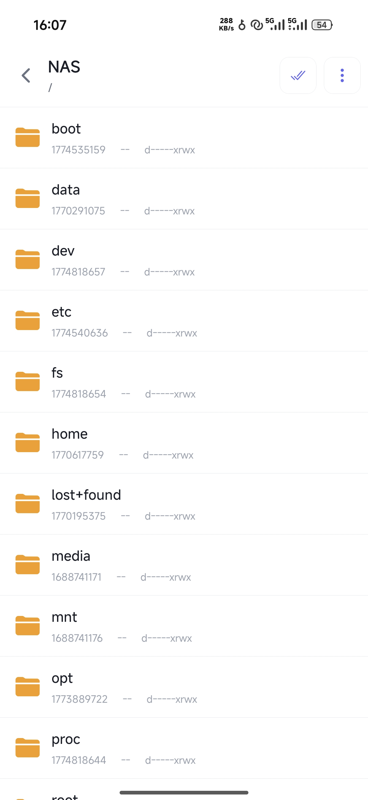
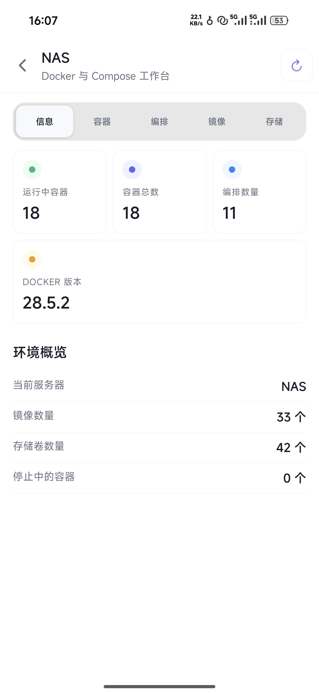
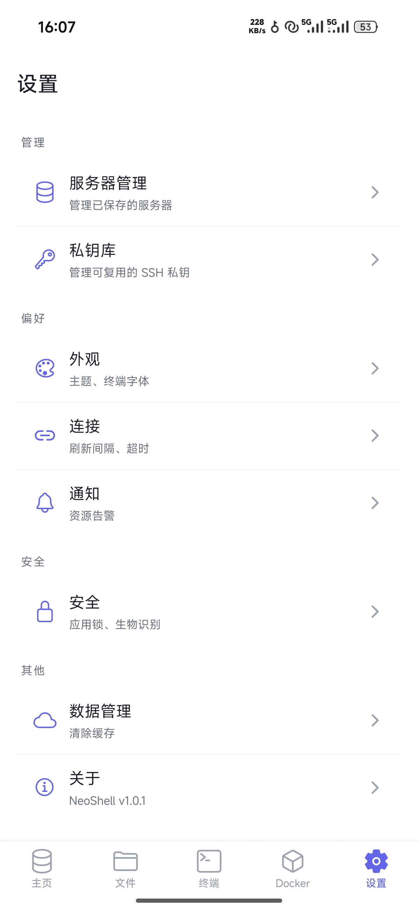

# NeoShell

NeoShell is a mobile server management app built for personal operations workflows. It connects directly to Linux servers over SSH and brings monitoring, terminal access, file management, and Docker operations into a single mobile interface.

- [中文](./README.zh.md)

## Features

- Real-time monitoring for CPU, memory, disk, network, and I/O
- Interactive SSH terminal powered by `xterm.js`
- SFTP file browser with upload, download, edit, compress, and extract flows
- Docker workspace for containers, Compose projects, images, volumes, and logs
- Security features including app lock, biometric-first verification, and private key management
- Light and dark themes with configurable terminal appearance

## Preview

| Home | Monitor Detail | Terminal |
| --- | --- | --- |
|  |  |  |

| Files | Docker | Settings |
| --- | --- | --- |
|  |  |  |

## Tech Stack

- Expo SDK 55
- React Native 0.83
- TypeScript
- Expo Router
- Zustand
- `@dylankenneally/react-native-ssh-sftp`
- `react-native-webview`
- `react-native-svg`

## Project Structure

```text
NeoShell/
├── app/              # Expo Router screens
├── assets/           # Images, icons, and fonts
├── components/       # Reusable UI and feature components
├── hooks/            # Shared hooks
├── services/         # SSH, SFTP, monitoring, Docker, and app services
├── stores/           # Zustand stores
├── theme/            # Design tokens and theme helpers
├── types/            # TypeScript types
├── LICENSE
├── README.md
└── README.zh.md
```

## Roadmap

- [ ] Monitoring detail widgets
- [ ] File and directory permission management
- [ ] Docker image update detection
- [ ] Docker image builds
- [ ] More themes and fonts
- [ ] Import and export
- [ ] WebDAV backup configuration

## Getting Started

### Requirements

- Node.js 20+
- npm
- Android Studio for local Android builds
- An Expo / EAS development environment

### Install

```bash
npm install
```

### Start the development server

```bash
npm run start
```

### Start with Dev Client

```bash
npm run start:dev-client
```

### Run on Android locally

```bash
npm run android
```

## Available Scripts

| Command | Description |
| --- | --- |
| `npm run start` | Start the Expo development server |
| `npm run start:dev-client` | Start Expo in Dev Client mode |
| `npm run android` | Run the Android build locally |
| `npm run build:android:development` | Trigger an Android development cloud build |
| `npm run build:android:preview` | Trigger an Android preview cloud build |
| `npm test` | Run the Vitest test suite |

## License

This project is licensed under the MIT License. See the [LICENSE](./LICENSE) file for details.
